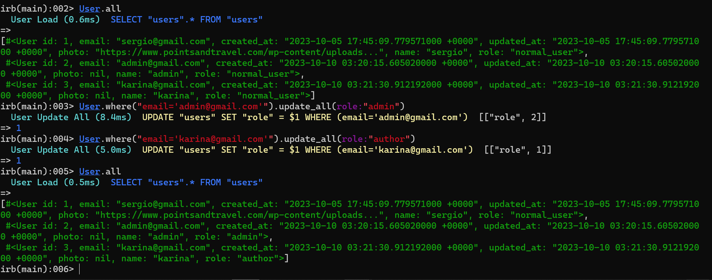

Descripción
Karina nos ha contactado sobre un desarrollo que le apasiona. Ella es una fotógrafa
reconocida mundialmente, sin embargo, no tiene una plataforma para poder exhibir su
trabajo. A pesar de que Instagram hace un buen trabajo, busca algo más profesional para
poder mantener el control sobre su trabajo y poder subir lo que ella desee sin condiciones.
Karina nos pide poder desarrollar una aplicación simple para que los usuarios puedan ver
sus fotografías y comentarlas. La llamaremos KariPic.
En su aplicación, los usuarios deben poder registrarse, con su nombre, email, contraseña y
foto de perfil. Por su parte, las fotografías irán con una leyenda que describe los
sentimientos y/o situaciones que Karina ha querido retratar y, por último, los comentarios
deben aparecer con la imagen de quien ha comentado y el contenido de su comentario.
Aplicando los conceptos y herramientas aprendidas hasta ahora, debes crear una
plataforma que pueda atender esta solicitud.
_ 1
www.desafiolatam.com
Requerimientos
1. En la aplicación, sólo Karina podrá subir sus fotos.
(2 Puntos)
Nota: genere roles: user, author y admin

nota: la password es la misma que utilizo para enseñarnos en clases.
cree cuenta usuario1@gmail.com para realizar los comentarios
cree cuenta karina@gmail.com y luego lo actualice y cambie el rol a author
cree cuenta admin@gmail.com y luego lo actualice y cambie el rol a admin
imagen de evidencia

2. Todo usuario que se registre debe tener su foto de perfil.
(2 Puntos)
3. Las imágenes deben estar cargadas en un bucket S3 llamado KariPic.
(2 Puntos)
Nota:mis tarjetas de debito no aplican para compras internacionales, debo resolverlos
adicionalmete a eso, no utilizare las credenciales del manual,
pues dice explicitamente "Las claves mostradas en pantalla son claves de prueba. Cada alumno
debe utilizar su propia clave."
dado lo anterior, comentare los pasos a seguir, para que las imagenes sean cargadas a bucket aws

1. instalar gema figaro
	a. bundle add figaro
	b. bundle exec figaro install

2. Necesitamos las claves de acceso Access Key ID y Secret access Key.
3. Agregamos las claves a nuestras variables de entorno.
	a. abrir config/application.yml
	b. añadir aws_access_key_id: 
	c. añadir aws_secret_access_key:
4. Modificamos el archivo de configuraciones development.rb.
	a. comentar la linea de codigo (anteponer #) -> #config.active_storage.service = :local
	b. añadir linea de codigo  config.active_storage.service = :amazon
5. Modificamos el archivo de configuraciones storage.yml y descomentamos las sgtes lineas
	# Use bin/rails credentials:edit to set the AWS secrets (as aws:access_key_id|secret_access_key)
	# amazon:
	#   service: S3
	#   access_key_id: <%= Rails.application.credentials.dig(:aws, :access_key_id) %>
	#   secret_access_key: <%= Rails.application.credentials.dig(:aws, :secret_access_key) %>
	#   region: us-east-1
	#   bucket: your_own_bucket-<%= Rails.env %>
6. Agregamos datos del bucket a nuestras variables de entorno, archivo config/applciation.yml
	aws_bucket_name: nombre del bucket que creamos
	aws_bucket_region: region del bucket que creamos
7. añadimos la gema S3 al proyecto y la instalamos
	a. bundle add aws-sdk-s3
	b. bundle install

para el ambiente de produccion

1. modificar archivo del ambiente, config/enviroments/production.rb
	a. comentar la linea de codigo (anteponer #) -> #config.active_storage.service = :local
	b. añadir linea de codigo  config.active_storage.service = :amazon

4. Los comentarios deben aparecer con la foto del usuario que ha comentado.
(2 Puntos)
5. Subir el proyecto a heroku y asegurarse de que este sea funcional.
(2 Puntos)

Nota: mis tarjetas de debito no me funcionaron en heroku, puedo acceder a servicios de streaming pero imposible a heroku, me rechazo todas mis tarjetas

explico las opciones que disponemos par deloyment en heroku

tenemos dos opciones
1 consola

1. realizamos login a heroku, con el comando heroku login
2. creamos la aplicacion, con el comando heroku create
3. subimos la aplicacion
	a. git init
	b. heroku git:remote -a nombre de tu proyecto creado en Heroku.
	c. git add .
	d. git commit -am "Feat: Primer commit to push to heroku"
	e. git push heroku main
	
cualquier mejora o actualizacion de la app
Dado que nuestra aplicación está enlazada a git debemos subir estos cambios,
repitiendo el proceso de:
	a. git add .
	b. git commit -m ”Describe el cambio realizado”
	c. git push heroku main

2 heroku + github

1. subir a github
	a. git add .
	b. git commit -m ”Describe el cambio realizado”
	c. git push origin main (o la rama)   
	
2. pull request
	a. con integracion continua ci/cd
	luego merge pull request
	confirm merge  -> lleva los cambios a main (github)

3. Nota: nos traemos la app a local con toda la integracion continua (ci/cd) del paso anterior
	git checkout main
	luego git pull origin main

4. ahora voy a heroku a crear la app
	a. 	le asigo el nombre de la app
	b. 	luego selecciono el metodo de deployment GitHub 	y lo conecto con la app que esta en github
	c. 	luego en automatic deploy, selecciono wait for CI to pass defore deploy (esperar a que termine la integracion continua en github
	d.	o voy a manual deploy, selecciono el branch  to deploy (main) y doy clic en deply branch 
